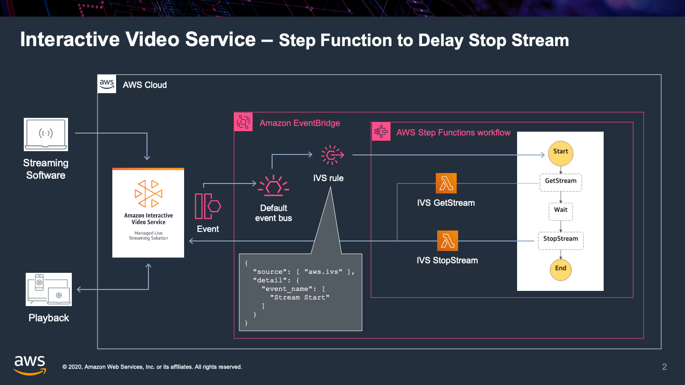

# IVS Monitor



This solution demonstrates a method for monitoring IVS for streams that are started in order to set a maximum stream time, using a Step Functions workflow to schedule an IVS StopStream API call a fixed number of seconds later.

The Step Functions [workflow definition](app/workflow.asl.json) has the max stream duration set to 120 seconds for demonstration purposes.

## Installation

### Prerequisites

Installation of this solution requires the [SAM CLI](https://docs.aws.amazon.com/serverless-application-model/latest/developerguide/serverless-sam-cli-install.html)

### Instructions

```bash
sam deploy --guided
```
