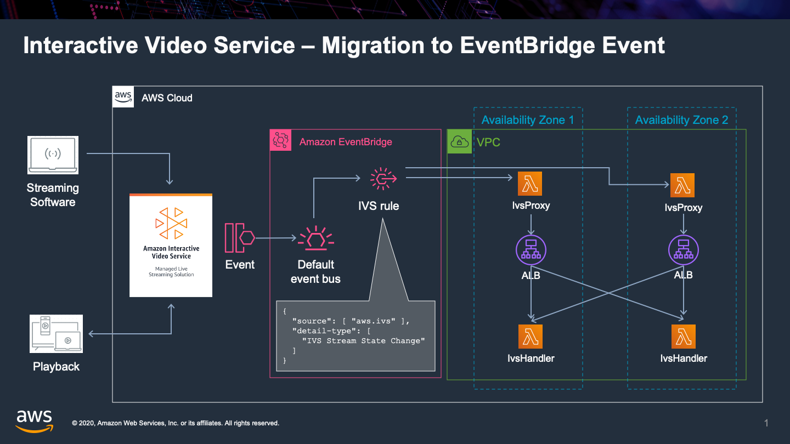

# IVS Proxy



This solution demonstrates a method for proxying IVS events to an internal Application Load Balancer via a VPC-attached proxy Lambda function (*IvsProxy*).  The ALB in this POC targets a Lambda function (*IvsHandler*) to process the IVS event, however other ALB targets can be substituted, including ECS Services.

## Installation

### Prerequisites

Installation of this solution requires the [SAM CLI](https://docs.aws.amazon.com/serverless-application-model/latest/developerguide/serverless-sam-cli-install.html)

### Instructions

```bash
sam deploy --guided --parameter-overrides VpcId=,SubnetIds=
```

During the SAM guided deploy, provide legitimate values for VpcId with at least **two (2)** SubnetIds in the VPC.
