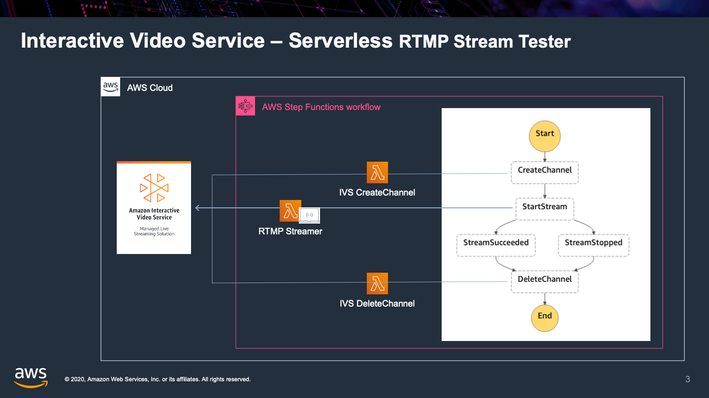

# IVS Tester



This solution demonstrates a method for using ffmpeg in a Lambda function to stream to IVS RTMP ingest endpoints.  A Step Function [workflow](app/workflow.asl.json) is used to orchestrate a test stream, which is executed providing a video URL and stream timeout:

```json
{
  "sourceVideoUrl": "https://fsd-share.s3.amazonaws.com/Jellyfish_720_10s_2MB.mp4",
  "streamTimeoutSeconds": 120
}
```

The [IVS Lambda function](app/ivs.js) creates an IVS channel for testing, generating an IVS ingest endpoint and stream key.  The [RTMP Lambda function](rtmp/rtmp.py) downloads the video URL and uses ffmpeg to stream to the IVS ingest endpoint.  The stream will loop indefinitely, and can either be terminated by an external IVS StopStream API call, in which case the StreamStopped state occurs, or the provided timeout expires, in which case the StreamSucceeded state occurs.  In either case, the [IVS Lambda function](app/ivs.js) is used to delete the channel.

**NOTE:** Lambda is a convenient means to stream to RTMP servers using ffmpeg, but it is limit to 15 maximum duration.  An ECS Task to stream using ffmpeg could be used as an alternative mechanism to exceed 15 minute stream durations.

## Installation

### Prerequisites

Installation of this solution requires the [SAM CLI](https://docs.aws.amazon.com/serverless-application-model/latest/developerguide/serverless-sam-cli-install.html)

### Instructions

```bash
sam deploy --guided --capabilities "CAPABILITY_IAM CAPABILITY_AUTO_EXPAND"
```
